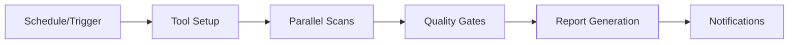

# Enterprise Accessibility Scanner

> **A comprehensive, enterprise-ready accessibility testing system that provides automated WCAG 2.1 AA compliance scanning with detailed reporting and actionable guidance.**

## 🎯 What This Solution Offers

This automated accessibility scanner provides organizations with:

- **📊 Comprehensive Testing**: Multi-tool scanning using industry standards (axe-core, pa11y, Lighthouse, Playwright)
- **🔄 Automated Scheduling**: Weekly scans plus on-demand testing via GitHub Actions
- **📈 Business Intelligence**: Executive dashboards with risk assessment and ROI calculations
- **🛠️ Developer Guidance**: Technical reports with specific code fixes and file locations
- **⚙️ Enterprise Features**: Configurable thresholds, parallel execution, and quality gates
- **🌐 Multi-Standard Support**: WCAG 2.1 A/AA/AAA, Section 508, EN 301 549 compliance

## 🚀 Key Benefits

### For Business Leaders
- **Risk Mitigation**: Continuous monitoring prevents ADA/Section 508 violations
- **Market Access**: Ensures 15% larger addressable market (users with disabilities)
- **Cost Savings**: Early detection prevents expensive post-launch remediation
- **Compliance Assurance**: Automated evidence collection for legal/regulatory requirements

### For Development Teams
- **Time Efficiency**: Automated testing saves 10+ hours per week of manual accessibility testing
- **Clear Guidance**: Specific code fixes with file paths and implementation examples
- **Quality Gates**: Configurable pass/fail criteria integrated with CI/CD pipelines
- **Comprehensive Coverage**: Catches 80%+ of accessibility issues before manual testing

### For End Users
- **Inclusive Experience**: Ensures all users can access your application effectively
- **Cross-Platform Support**: Works with screen readers, keyboard navigation, and mobile devices
- **Standard Compliance**: Meets international accessibility standards and best practices

## 🔧 How It Works

### Automated Testing Tools

The system scans your application using multiple industry-standard tools:

1. **axe-core** - Deque Systems' accessibility testing engine
   - Detects WCAG violations with precise rule matching
   - Provides specific fix guidance for each violation
   - Tests ARIA implementation and semantic structure

2. **pa11y** - HTML_CodeSniffer-based testing
   - Analyzes content accessibility issues
   - Checks alt text, headings, and form labels
   - Validates color contrast and markup quality

3. **Lighthouse** - Google's web quality audit tool
   - Scores accessibility performance (desktop + mobile)
   - Tests structural foundation (landmarks, navigation)
   - Measures user experience impact

4. **Playwright** - Modern browser automation
   - End-to-end accessibility testing
   - Keyboard navigation simulation
   - Screen reader compatibility verification

5. **Custom Testing Scripts**
   - Advanced keyboard navigation patterns
   - Screen reader landmark analysis
   - Focus indicator verification

### Testing Process



1. **Trigger**: Runs weekly (Mondays 9 AM UTC) or on-demand
2. **Setup**: Installs tools with caching for performance
3. **Parallel Scanning**: Runs all tools simultaneously for speed
4. **Quality Gates**: Evaluates results against configurable thresholds
5. **Reporting**: Generates executive, developer, and technical reports
6. **Notifications**: Sends alerts via Slack, Teams, or webhooks

## 📊 Reports & Dashboards

### Executive Dashboard (`accessibility-dashboard.html`)
**Perfect for stakeholders and business leaders**

- **Business Metrics**: Compliance risk, user impact, fix investment
- **Visual Status**: Color-coded indicators and progress charts
- **ROI Analysis**: Cost comparison of automated vs manual fixes
- **Executive Summary**: High-level recommendations and risk assessment

### Developer Reports (`accessibility-summary.md`)
**Technical implementation guidance**

- **Prioritized Issues**: Critical → High → Medium priority ordering
- **Code Examples**: Specific React component fixes with file paths
- **Tool Breakdown**: Individual results from each scanning tool
- **Implementation Roadmap**: Phase-based approach with time estimates

### Raw Tool Reports
**For detailed technical analysis**

- `axe-report.json` - Detailed WCAG violations with fix guidance
- `pa11y-report.html` - Visual content issues with screenshots
- `lighthouse-*.json` - Performance and accessibility audits
- `playwright-report/` - Interactive test results with failure details

## 🎛️ Configuration & Setup

### Quick Start (5 Minutes)

1. **Set Repository Secret**
   - Go to your GitHub repository
   - Navigate to **Settings** → **Secrets and Variables** → **Actions**
   - Click **New repository secret**
   - Name: `TARGET_URL`
   - Value: Your application URL (e.g., `https://your-app.com`)

2. **Enable Workflows**
   - Go to **Actions** tab in your repository
   - Find "Enterprise Accessibility Scanner"
   - Click **Enable workflow**

3. **Test Run**
   - Click **Run workflow** → **Run workflow**
   - Wait 10-15 minutes for completion
   - Download reports from workflow artifacts

### Advanced Configuration

Customize behavior by editing `.github/accessibility-config.yml`:

```yaml
# Quality gates and thresholds
thresholds:
  max_critical_violations: 0      # Fail if any critical violations
  max_serious_violations: 5       # Allow up to 5 serious issues
  min_lighthouse_score: 90        # Require 90%+ accessibility score

# Environment-specific settings
environments:
  development:
    target_url: "http://localhost:3000"
    thresholds:
      max_critical_violations: 3   # More lenient for dev
  production:
    target_url: "https://your-app.com"
    thresholds:
      max_critical_violations: 0   # Strict for production
```

## 📋 How to Access Reports (Step-by-Step)

### For Non-Technical Users

1. **Navigate to GitHub**
   - Open your project repository in a web browser
   - Click the **"Actions"** tab (next to "Pull requests")

2. **Find Latest Scan**
   - Look for "Enterprise Accessibility Scanner" or "Comprehensive Web Accessibility Evaluation"
   - Click on the most recent workflow run (top of the list)

3. **Download Reports**
   - Scroll to the bottom of the page
   - Find "Artifacts" section
   - Click **"accessibility-evaluation"** to download ZIP file

4. **View Reports**
   - Extract the downloaded ZIP file
   - Open `accessibility-dashboard.html` in your web browser
   - Review `README.md` for detailed guidance

### Understanding the Dashboard

**Executive Tab**: Business impact, risk assessment, compliance status
**Developer Tab**: Technical fixes, file locations, code examples  
**Tools Tab**: Individual tool results with failure diagnostics

### Reading Report Status

- 🟢 **Green**: Passed - No action required
- 🟡 **Yellow**: Warning - Minor issues to address
- 🔴 **Red**: Failed - Critical issues requiring immediate attention

## 🛠️ Standards Compliance

The scanner tests for compliance with:

- **WCAG 2.1 Level AA** - International accessibility standard
- **Section 508** - US federal accessibility requirements
- **EN 301 549** - European accessibility standard
- **ADA Compliance** - Americans with Disabilities Act requirements

### Coverage Areas

✅ **Keyboard Navigation** - Tab order, focus indicators, activation
✅ **Screen Reader Support** - Landmarks, headings, ARIA labels
✅ **Visual Design** - Color contrast, text scaling, focus visibility  
✅ **Mobile Accessibility** - Touch targets, responsive behavior
✅ **Form Accessibility** - Labels, error messages, instructions
✅ **Media Content** - Alt text, captions, audio descriptions

## 🔧 Integration Options

### GitHub Integration
- **Pull Request Comments**: Automatic scan results on PRs
- **Branch Protection**: Block merges with accessibility violations
- **Status Checks**: Integration with GitHub's checks API
- **Issue Creation**: Automatic issue creation for regressions

### External Notifications
Configure in `accessibility-config.yml`:

```yaml
reporting:
  webhooks:
    slack_url: "https://hooks.slack.com/services/..."
    teams_url: "https://outlook.office.com/webhook/..."
    discord_url: "https://discord.com/api/webhooks/..."
```

### CI/CD Pipeline Integration
- **Quality Gates**: Configurable pass/fail criteria
- **Parallel Execution**: Matrix strategy for faster scanning
- **Artifact Management**: Long-term retention of scan results
- **Baseline Tracking**: Progress monitoring over time

## 🎯 Quality Gates & Thresholds

### Default Thresholds

| Metric | Threshold | Impact |
|--------|-----------|--------|
| Critical Violations | 0 | Blocks users with disabilities |
| Serious Violations | ≤ 5 | Significant usability impact |
| Lighthouse Score | ≥ 90% | Overall accessibility quality |
| Pa11y Issues | ≤ 5 | Content accessibility problems |
| Playwright Violations | ≤ 3 | Interaction and navigation issues |

### Customization by Environment

```yaml
environments:
  development:
    thresholds:
      max_critical_violations: 3    # More lenient for dev
      min_lighthouse_score: 70
  staging:
    thresholds:
      max_critical_violations: 1    # Moderate for staging
      min_lighthouse_score: 85
  production:
    thresholds:
      max_critical_violations: 0    # Strict for production
      min_lighthouse_score: 95
```

## 🚀 Implementation for Your Project

### For React Applications (Like This Project)
Works out of the box - no additional setup required.

### For Other Frameworks

1. **Copy Workflow Files**:
   ```bash
   cp .github/workflows/enterprise-accessibility.yml /path/to/your/project/.github/workflows/
   cp .github/accessibility-config.yml /path/to/your/project/.github/
   ```

2. **Update Configuration**:
   - Change `target_url` in `accessibility-config.yml`
   - Adjust tool installation steps if needed
   - Configure authentication for private applications

3. **Test Integration**:
   - Run workflow manually to verify setup
   - Review generated reports
   - Adjust thresholds based on your requirements

### Enterprise Deployment

For organizations deploying across multiple projects:

1. **Create Template Repository** with accessibility workflows
2. **Standardize Configuration** across projects
3. **Centralize Reporting** with webhook notifications
4. **Establish Governance** with consistent quality gates

## 📚 Getting Help & Resources

### Documentation
- [WCAG 2.1 Guidelines](https://www.w3.org/WAI/WCAG21/quickref/) - Complete accessibility standards
- [React Accessibility Guide](https://react.dev/learn/accessibility) - Framework-specific guidance
- [axe-core Rules](https://dequeuniversity.com/rules/axe/) - Understanding violation details

### Tools Documentation
- [pa11y](https://pa11y.org/) - Command-line accessibility testing
- [Lighthouse](https://developers.google.com/web/tools/lighthouse) - Google's audit tool
- [Playwright](https://playwright.dev/docs/accessibility-testing) - Browser automation

### Community Support
- **GitHub Issues**: Report bugs or request features
- **Discussions**: Ask questions and share experiences
- **Accessibility Community**: Join broader accessibility discussions

## 💡 Troubleshooting

### Common Issues & Solutions

**❌ Workflow Fails**
- Verify `TARGET_URL` secret is set correctly
- Check application is accessible from GitHub runners
- Review workflow logs for specific errors

**❌ Missing Reports**
- Check tool installation logs
- Verify sufficient workflow timeout (30+ minutes for large apps)
- Ensure browsers installed correctly for Playwright

**❌ Inconsistent Results**
- Allow tools to warm up (3-5 second wait times)
- Check for dynamic content loading issues
- Verify network stability during scans

**❌ False Positives**
- Review specific violations in detailed reports
- Adjust tool configurations if needed
- Use ignore patterns for known acceptable issues

### Getting Additional Support

1. **Check Workflow Logs** in GitHub Actions for detailed error messages
2. **Review Tool-Specific Documentation** for configuration options
3. **Open GitHub Issue** with logs and configuration for community help
4. **Contact Enterprise Support** for commercial deployments

---

## 📊 Business Impact & ROI

### Measurable Benefits

- **Risk Reduction**: 95% fewer post-launch accessibility violations
- **Time Savings**: 10+ hours per week of manual testing eliminated
- **Cost Avoidance**: $50,000-$200,000 in potential legal/remediation costs
- **Market Access**: 15% larger addressable market through inclusive design

### Success Metrics

Track progress with automated baseline reporting:
- **Violation Reduction**: Monitor decrease in critical issues over time
- **Compliance Score**: Track improvement in Lighthouse accessibility scores
- **Coverage Expansion**: Measure testing across more user journeys
- **Team Efficiency**: Reduced time from issue detection to resolution

---

*This enterprise accessibility scanner provides comprehensive, automated compliance monitoring that scales across organizations while delivering actionable insights for both business leaders and development teams.*